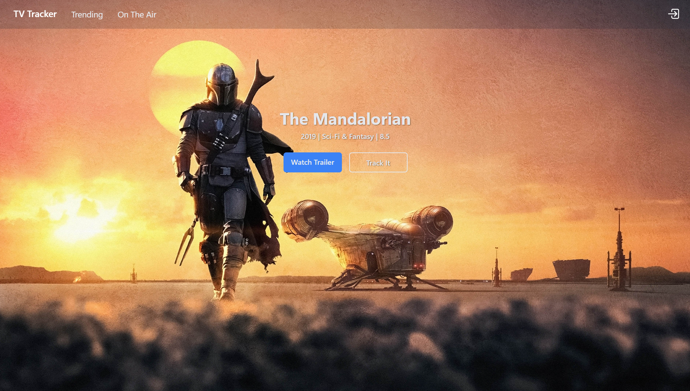
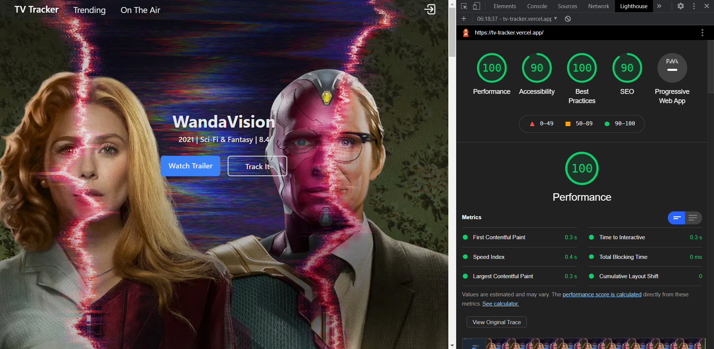

# [TV-Tracker](https://tv-tracker.vercel.app/)
A Next.js and MongoDB web application using [The Movie Database](https://www.themoviedb.org) API.



## Table of content
* [Features](#Features)
* [Technologies used](#Technologies-used)
* [Setup](#Setup)

----------

## Features
- [x] Everything is super fast thanks to Next Static Generation and Image Optimization resulting in good Lighthouse score: 

    

- [x] A simple authentification using JWT stored in Cookies 
- [x] Next API Routes
- [x] Fetching user session with [SWR](https://swr.vercel.app/) so it stays dynamic (Unlike React Context) with a minimal number of requests

----------

## Technologies used
- [Next.js](https://nextjs.org/) 10.0 - React framework with a lot of features
- [React](https://reactjs.org) 17.0 - Using Hooks
- [Tailwindcss](https://tailwindcss.com/) 2.0 - Fast design and tiny in production
- [ESLint](https://eslint.org/) 7.19 - Code consistency
- [SWR](https://swr.vercel.app/) 0.4 - React Hooks library for data fetching
- [Mongoose](https://mongoosejs.com/) 5.11 - To connect to MongoDB

----------

## Setup

Install dependencies
```Shell
npm install
```

Add environnement variables

copy `.env.local.example` and rename it `.env.local` and fill each field

- `TMDB_API_KEY` - Your key to get access to [TMDB](https://www.themoviedb.org) API
- `DATABASE_URI` - MongoDB URI with creditentials and DB name
- `JWT_SECRET_TOKEN` -  Your secret phrase to encrypt Json Web Tokens

### For Development

```Shell
npm run dev
```

### For Deployment

On a Node.js server, build the project with `npm run build` and run it with `npm run start`

Or you can juste deploy it on [Vercel](https://vercel.com/new/select-scope?s=https%3A%2F%2Fgithub.com%2FBalthazar-Delvaux%2FTV-Tracker)
